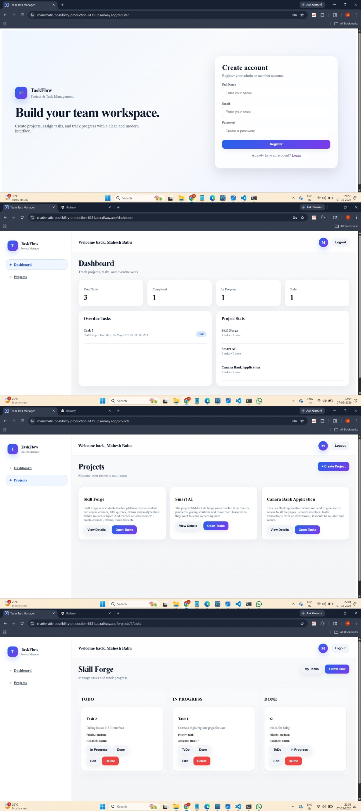
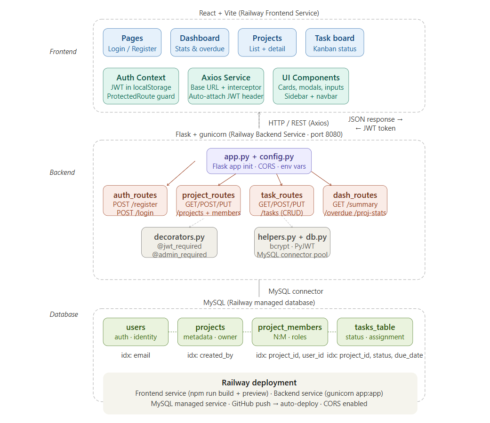
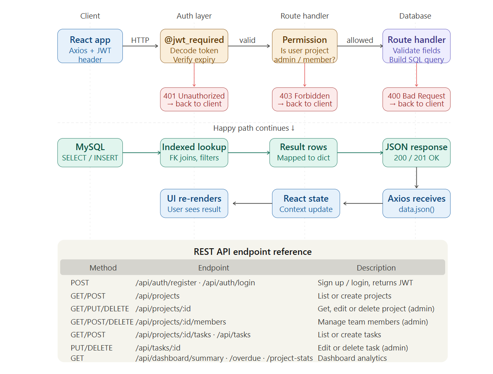
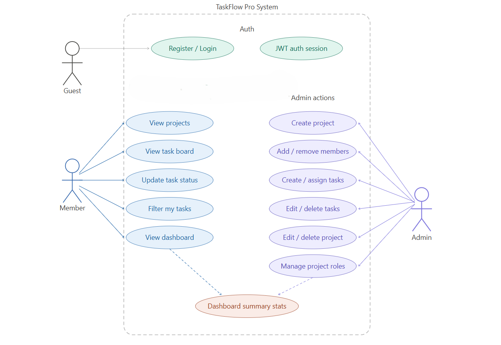

# Team Task Manager

A full-stack project management web application where users can create projects, invite team members, create tasks, assign tasks, update task status, and track progress with role-based access control.
This project demonstrates hands-on experience in designing and developing full-stack web applications using REST APIs, backend architecture, relational SQL database design, table relationships, indexing optimization, authentication systems, role-based access control, frontend development, API integration, and real-world cloud deployment using Railway.





----

## 1) Project Scope

This project is designed as a real-world team collaboration and task tracking platform. The goal is to give users a simple but professional system where they can:

- sign up and log in securely,
- create and manage projects,
- add team members to a project,
- create tasks and assign them to project members,
- update task status through a Kanban-style workflow,
- track project progress using dashboard summaries,
- manage access using project-level roles.
  
This project was built to demonstrate a production-style full-stack workflow with frontend, backend, database, validation, relationships, indexing, and deployment.

---

## 2) About the Project

Team Task Manager is a task management application for teams. Each project has its own members and its own task board. A user who creates a project becomes the admin for that project, and that admin can manage members and tasks in that project.

The application supports:

- user authentication,
- project management,
- team member management,
- task management,
- dashboard statistics,
- role-based permissions,
- Railway deployment.

---

## 3) Main Features

### Authentication
- Signup
- Login
- JWT-based session handling
- Email validation
- Secure password hashing

### Project & Team Management
- Create project
- View projects
- View project members
- Add members to a project using email
- Remove members from a project
- Edit project title and description
- Delete project

### Task Management
- Create task
- Assign task to a project member
- Update task status
- Edit task details
- Delete task
- Filter by my tasks / all tasks
- Kanban-style task board

### Dashboard
- Total task count
- Todo / In Progress / Done counts
- Overdue tasks
- Project-wise task summary

### Role-Based Access
- Project admin can manage project and tasks
- Project members can view and work on tasks
- Access is controlled at project level, not only global user level

---

## 4) Tech Stack

### Frontend
- React
- Vite
- Axios
- React Router DOM
- Context API
- Custom reusable components

### Backend
- Python
- Flask
- Flask-CORS
- MySQL Connector
- PyJWT
- bcrypt
- gunicorn

### Database
- MySQL

### Deployment
- Railway

### Version Control
- Git
- GitHub

---

Full Stack Architecture:



---

## 5) Database Schema Architecture

The database is normalized and designed around real relationships.

### Tables Used
- `users`
- `projects`
- `project_members`
- `tasks_table`

### Relationship Overview
- One user can create many projects.
- One project can have many members.
- One user can belong to many projects.
- One project can have many tasks.
- One task belongs to one project.
- One task can be assigned to one user.

### Relationship Diagram 

```text
users
  │
  ├── creates ──> projects
  │                 │
  │                 ├── has many ──> tasks_table
  │                 │
  │                 └── has many ──> project_members
  │
  └── belongs to many projects through project_members

```


### 6.1 `users`
Stores registered users.

Important columns:
- `id`
- `username` / `name`
- `email`
- `password_hash`
- `role` 
- `created_at`

Purpose:
- authentication
- identity
- project membership mapping

---

### 6.2 `projects`
Stores project details.
Important columns:
- `id`
- `title` / `name`
- `description`
- `created_by`
- `created_at`

Purpose:
- store project metadata
- connect project to creator
- drive project-level access

---

### 6.3 `project_members`
Stores project membership and project-level role.

Important columns:
- `id`
- `project_id`
- `user_id`
- `role`
- `joined_at`

Purpose:
- many-to-many mapping between users and projects
- project-level role control
- member management

Role meanings:
- `admin` = project owner / project manager
- `member` = regular project team member

---

### 6.4 `tasks_table`
Stores tasks for each project.

Important columns:
- `id`
- `title`
- `description`
- `status`
- `priority`
- `due_date`
- `project_id`
- `assigned_to`
- `created_by`
- `created_at`
- `updated_at`

Purpose:
- task creation
- task assignment
- task status tracking
- dashboard analytics

---

## 7) Indexing Strategy in MySQL

Indexes were added only where they are useful for performance.

### Indexed Columns
- `users.email`
- `projects.created_by`
- `project_members.project_id`
- `project_members.user_id`
- `tasks_table.project_id`
- `tasks_table.assigned_to`
- `tasks_table.status`
- `tasks_table.priority`
- `tasks_table.due_date`

### Why indexing was used
Indexes improve performance for:
- login by email,
- loading user projects,
- loading project members,
- loading task boards,
- filtering tasks by status,
- loading “my tasks”,
- finding overdue tasks,
- dashboard summary queries.

### Why not index everything
Indexing every column increases storage and can slow inserts/updates.  
So only columns used frequently in filters, joins, and lookups were indexed.

---

## 8) Backend Architecture

The backend is written in Flask and follows a REST API structure.

### Backend Responsibilities
- connect to MySQL,
- register and login users,
- hash and verify passwords,
- issue JWT tokens,
- protect routes,
- validate project access,
- handle task and project operations,
- calculate dashboard stats,
- return JSON responses to frontend.

### Backend Security / Validation
The backend includes:
- required-field validation,
- Gmail validation for registration,
- duplicate email protection,
- password hashing with bcrypt,
- JWT authentication,
- project-level permission checks,
- task assignment validation,
- access control for admin/member operations.


### REST API Design
The API is structured using standard REST patterns:



---

## 9) Frontend Architecture

The frontend is built using React + Vite.

### Frontend Responsibilities
- show login/register screens,
- store token and user data,
- protect private routes,
- display dashboard cards,
- show project lists,
- open project detail pages,
- show task boards,
- display member dropdowns,
- allow editing and deleting based on permissions,
- call backend APIs through Axios.

### Frontend State Handling
- `Context API` for auth state,
- `localStorage` for token persistence,
- `ProtectedRoute` for private pages,
- Axios interceptor to attach JWT automatically.

---

## 10) Deployment Architecture

The project is deployed using Railway.

### Railway Services Used
- Frontend service
- Backend service
- MySQL database service

### Deployment Flow
1. Push code to GitHub.
2. Create Railway project.
3. Add MySQL service.
4. Add backend service from the GitHub repo.
5. Add frontend service from the same GitHub repo.
6. Configure root directories:
   - backend service → `backend`
   - frontend service → `frontend`
7. Add backend environment variables.
8. Use Railway MySQL variables in backend config.
9. Set frontend Axios base URL to the backend public URL.
10. Deploy and test.
    

### Backend Deployment Notes
- The backend runs using `gunicorn`.
- Railway listens on port `8080`.
- CORS is enabled to allow frontend requests.

### Frontend Deployment Notes
- The frontend is built using Vite.
- The build uses `npm run build`.
- The preview/start command runs on the Railway provided port.
- Vite allowed host configuration was adjusted for Railway domain access.

---
USE CASE Diagram:



---
## 11) How to Run the Project Locally from GitHub

### Prerequisites
Install:
- Python 3.11+ (or compatible)
- Node.js 18+
- MySQL server or MySQL Workbench
- Git

---

### Step 1: Clone the repository
```bash
git clone <your-github-repo-url>
cd Team_Task_Manager
```

---

### Step 2: Create the database
Open MySQL Workbench or any MySQL client and run the SQL schema from this README.

Make sure the tables are created:
- `users`
- `projects`
- `project_members`
- `tasks_table`

---

### Step 3: Set backend environment variables
Create a `.env` file inside `backend/`:

```env
MYSQLHOST=localhost
MYSQLPORT=3306
MYSQLUSER=root
MYSQLPASSWORD=your_password
MYSQLDATABASE=team_task_manager
SECRET_KEY=your_secret_key
```

If using Railway or remote MySQL, replace these with the correct values.

---

### Step 4: Install backend dependencies

cd backend
pip install -r requirements.txt

If you use a virtual environment:

python -m venv venv
venv\Scripts\activate
pip install -r requirements.txt

---

### Step 5: Run the backend

python app.py


Or if you want production-like local run:

gunicorn app:app

---

### Step 6: Configure frontend API URL
Open:

frontend/src/services/api.js

Set:

baseURL: "http://127.0.0.1:5000/api"

If backend runs on another host or port, update it accordingly.

---

### Step 7: Install frontend dependencies

cd ../frontend
npm install

---

### Step 8: Run the frontend

npm run dev


The frontend will usually run on:

http://localhost:5173

---

## 12) Important Setup Notes

- If the backend and frontend are running separately, make sure the backend CORS settings allow the frontend origin.
- The backend must use the same database schema as the frontend expects.
- The task assignment dropdown expects project members to be present.
- The project creator becomes the project admin automatically.

---

## 13) Validation Rules Used

### Signup / Login
- required fields cannot be empty,
- Gmail validation on register,
- duplicate email not allowed,
- passwords are stored hashed.

### Project Validation
- project name is required,
- only project admin can edit/delete project,
- only project admin can add/remove members.

### Task Validation
- title and project are required,
- assignee must be a project member,
- task access is restricted by project membership,
- only project admin can create/edit/delete tasks.

---

## 14) Final Summary

Team Task Manager / TaskFlow Pro is a Railway-deployed full-stack team collaboration platform that lets users:
- sign up and log in,
- create projects,
- manage team members,
- create and assign tasks,
- track task status,
- view dashboards,
- work with project-level permissions.

It uses:
- React for the frontend,
- Flask for the backend,
- MySQL for relational data,
- JWT for authentication,
- Railway for deployment.
---

Live App:  https://charismatic-possibility-production-6131.up.railway.app/register
---
